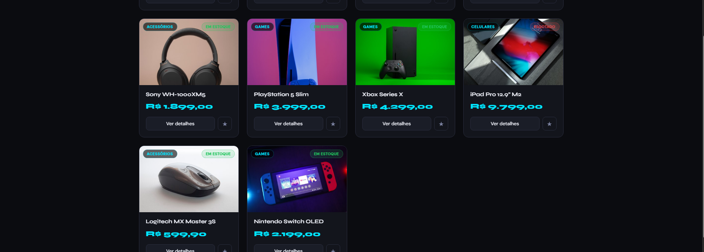
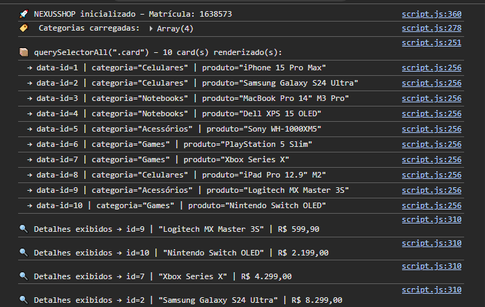

# Mini Ecommerce – Catálogo em Cards

**Aluno:** Henrique Ignacio Ferreira Souza  
**Matrícula:** 1638573  
**Disciplina:** Desenvolvimento Web  

---

## 📋 Sobre o Projeto

Aplicação de catálogo de produtos tech desenvolvida com HTML, CSS e JavaScript puro.  
O usuário pode buscar produtos por nome, filtrar por categoria, ver detalhes e destacar cards.

---

## ✅ Funcionalidades Implementadas

| Funcionalidade | Status |
|---|---|
| 10 produtos renderizados em cards | ✅ |
| Select de categorias preenchido dinamicamente | ✅ |
| Busca por texto filtra produtos | ✅ |
| Filtro por categoria funciona | ✅ |
| "Ver detalhes" exibe informações completas | ✅ |
| "Destacar" altera visual do card | ✅ |
| `getElementById` | ✅ |
| `querySelector` | ✅ |
| `querySelectorAll` | ✅ |
| `innerHTML` | ✅ |
| `createElement`, `setAttribute`, `appendChild` | ✅ |
| `classList.add`, `style` | ✅ |
| `addEventListener` | ✅ |

---

## 🛠 Tecnologias

- HTML5
- CSS3 (variáveis, Grid, Flexbox, animações)
- JavaScript ES6+ (vanilla)

---

## 📸 Prints

> **Instruções:** substitua os placeholders abaixo pelos seus prints reais antes de entregar.

### Cards Renderizados


### Área de Detalhes Preenchida


### Console do Navegador (querySelectorAll)


---

## 🚀 Como Executar

1. Clone o repositório:
   ```bash
   git clone <url-do-repositorio>
   ```
2. Abra o arquivo `index.html` diretamente no navegador  
   *(ou use a extensão Live Server no VS Code)*

---
